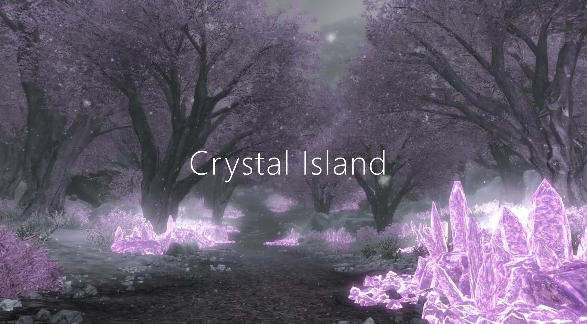

# Crystal Island

Crystal Island is a first-person 3D game where your goal is to collect all the crystals hidden around the island.

You can download the game file from [Dropbox](https://www.dropbox.com/sh/bacs7hrtvnvpxym/AABQsU4aIlpHEG5OZmXHa9NEa?dl=0). Download the whole folder and don't move the .exe file from the folder - it needs to remain in the same folder with all the other files in order to work.

# How to play
* Press any key to continue on to the game or press ESC to quit.
* Set your direction with the mouse.
* Move forward, backward, left, and right with the arrow keys, jump with the space bar.
* Collect all the crystals!
* Avoid the water: the player dies and the game ends if the player goes underwater.
* There is no time limit or time bonus; you can just wander around the island and listen to the crickets if you wish.

# Creator
Heta Björklund
 * Github: https://github.com/hetabjorklund
 * LinkedIn: https://www.linkedin.com/in/heta-bjorklund

# Acknowledgements

Made with [Unity](https://unity.com/).

## Background images
Intro scene: ["Crystal Forest" by Amethyne Shepard](https://www.pinterest.com/pin/440578776037876484/)\
Game over scene: [Diamond Wallpaper 10367](https://hdwallsource.com/diamond-wallpaper-10367.html)

## Game elements
Boats: ["Fishing Boat" by ozgur](https://assetstore.unity.com/packages/3d/vehicles/sea/fishing-boat-23181)\
Crystals: ["Translucent Crystals" by SineVFX](https://assetstore.unity.com/packages/3d/environments/fantasy/translucent-crystals-106274)\
Pebble terrain: https://pixabay.com/photos/pebbles-background-stone-980508/\
Sky: ["AllSky Free - 10 Sky / Skybox Set" by rpgwhitelock](https://assetstore.unity.com/packages/2d/textures-materials/sky/allsky-free-10-sky-skybox-set-146014)

## Sounds and music
Crystal sound effect: ["Magical" by Mike Koenig](https://soundbible.com/1088-Magical.html)\
Music in the intro and game over scenes: ["Daydreaming" by Lisa Redfern](
https://soundbible.com/2030-Daydreaming.html)\
Music in the main scene: ["Crickets At Night" by Mike Koenig](https://soundbible.com/365-Crickets-At-Night.html)
